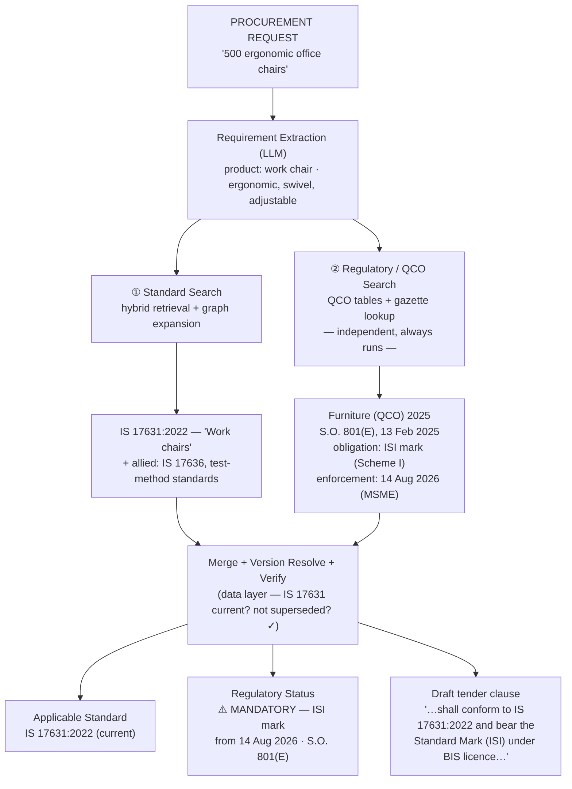
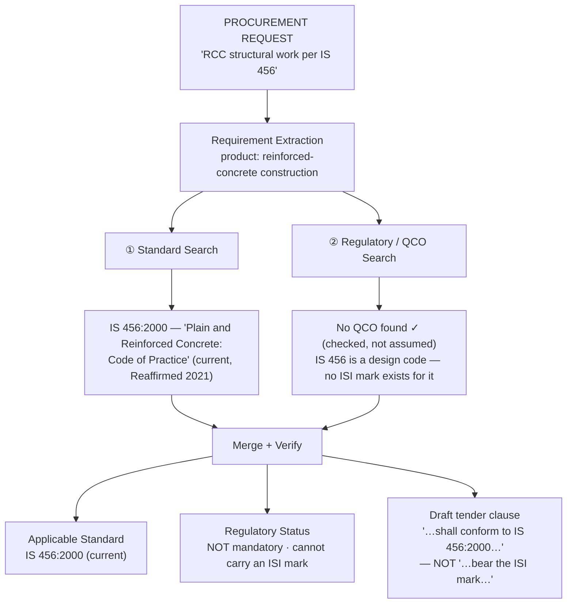

# SIH26108 — Demo Flow (for the presentation)

The core visual: **two independent branches — Standard Search and Regulatory/QCO Search — that run in parallel and converge.** The regulatory branch always runs and always returns a *verified* result, including "no QCO found". The system never infers "mandatory" from the existence of a standard.

---

## Mandatory case — office chairs

## Voluntary case — concrete code of practice

---

## Why this is the pitch

| | Naive system ("found a standard → require ISI mark") | This system |
|---|---|---|
| Office chairs | ⚠️ mandatory (right by luck) | ⚠️ mandatory — with S.O. number + enforcement date |
| RCC / IS 456 | "shall bear ISI mark" ❌ **restrictive spec — GFR Rule 144 violation** | "shall conform to IS 456" ✅ |
| OPC 43 grade / IS 8112 | "not in QCO list → voluntary" ❌ | IS 8112 withdrawn → IS 269:2015 → mandatory ✅ |

The regulatory branch is a **separate query against the QCO layer for the product**, not a property read off the standard. "No QCO found" is a verified finding.

## Full demo set (4 scenarios)

1. **Recently mandatory** — furniture / IS 17631 → Furniture QCO 2025, MSME deadline 14 Aug 2026.
2. **Voluntary / code of practice** — RCC / IS 456 → applies, not mandatory, no ISI mark.
3. **Supersession trap** — "OPC 43 grade to IS 8112" → withdrawn → IS 269:2015 → mandatory (Cement QCO 2003).
4. **Hindi** — "मोटरसाइकिल हेलमेट के लिए मानक" → IS 4151:2015, mandatory since Nov 2020, answered in Hindi.

Every scenario is a case where the obvious approach fails.

**Sources:** Furniture QCO 2025 — https://furnituredesignindia.com/articles/90910/govt-announces-mandatory-qco-bis-on-furniture-w-e-f-13th-feb-2026 · rest per `docs/research/sih26108-bis-ecosystem-data-archaeology.md`.
